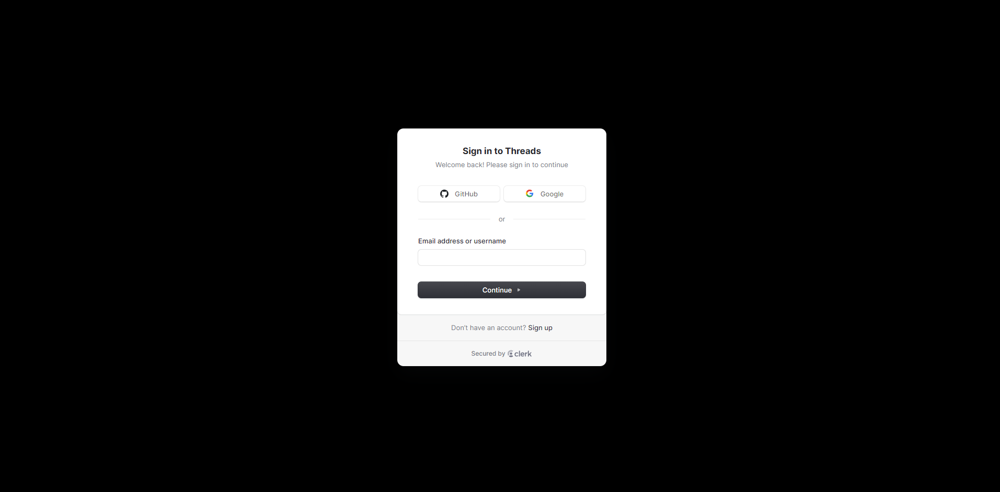
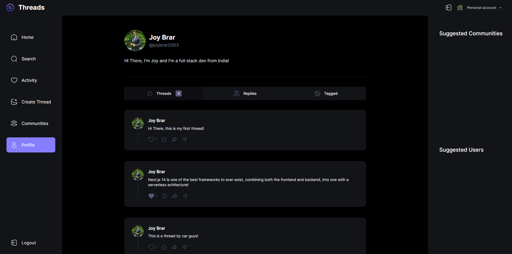
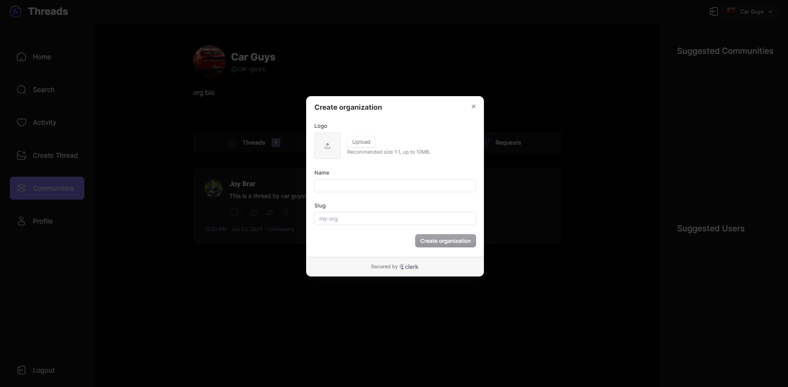

# Threads 📝

Welcome to Threads App, a high-fidelity full-stack web application designed to foster community engagement through threaded discussions. This app offers a seamless user experience with a focus on performance, security, and scalability. Built with modern web technologies, Threads App is your go-to platform for creating and managing communities, engaging in discussions, and connecting with others.

## 💻 Tech Stack

- **Next.js**
- **MongoDB**
- **Shadcn UI**
- **TailwindCSS**
- **Clerk**
- **Webhooks**
- **Serverless APIs**
- **React Hook Form**
- **Zod**
- **TypeScript**

## 🔐 Features

- **Authentication**: Authentication using Clerk for email, password, and social logins (Google and GitHub) with a comprehensive profile management system.



- **Visually Appealing Home Page**: A visually appealing home page showcasing the latest threads for an engaging user experience.


- **Create Thread Page**: A dedicated page for users to create threads, fostering community engagement.

- **Commenting Feature**: A commenting feature to facilitate discussions within threads.

- **Nested Commenting**: Commenting system with nested threads, providing a structured conversation flow.

- **User Search with Pagination**: A user search feature with pagination for easy exploration and discovery of other users.

- **Activity Page**: Display notifications on the activity page when someone comments on a user's thread, enhancing user engagement.

- **Profile Page**: User profile pages for showcasing information and enabling modification of profile settings.



- **Create and Invite to Communities**: Allow users to create new communities and invite others using customizable template emails.

- **Community Member Management**: A user-friendly interface to manage community members, allowing role changes and removals.

- **Admin-Specific Community Threads**: Enable admins to create threads specifically for their community.

- **Community Search with Pagination**: A community search feature with pagination for exploring different communities.

- **Community Profiles**: Display community profiles showcasing threads and members for a comprehensive overview.

- **Figma Design Implementation**: Transform Figma designs into a fully functional application with pixel-perfect and responsive design.

- **Blazing-Fast Performance**: Optimal performance and instantaneous page switching for a seamless user experience.

- **Server Side Rendering**: Utilize Next.js with Server Side Rendering for enhanced performance and SEO benefits.

- **MongoDB with Complex Schemas**: Handle complex schemas and multiple data populations using MongoDB.

- **File Uploads with UploadThing**: File uploads using UploadThing for a seamless media sharing experience.



- **Real-Time Events Listening**: Real-time events listening with webhooks to keep users updated.

- **Middleware, API Actions, and Authorization**: Utilize middleware, API actions, and authorization for robust application security.

- **Next.js Layout Route Groups**: New Next.js layout route groups for efficient routing.

- **Data Validation with Zod**: Data integrity with data validation using Zod.

- **Form Management with React Hook Form**: Efficient management of forms with React Hook Form for a streamlined user input experience.

And many more, including code architecture and reusability.

## ⚙️ Getting Started

### Prerequisites

- Node.js (v16 or higher)
- npm or yarn
- MongoDB
- Clerk account

### Installation

1. **Clone the repository:**
    ```bash
    git clone https://github.com/your-username/threads-app.git
    cd threads-app
    ```

2. **Install Dependencies:**
    ```bash
    npm install
    # or
    yarn install
    ```

3. **Set up environment variables:**
    Create a .env file in the root directory and add the following variables:
    ```bash
    NEXT_PUBLIC_CLERK_PUBLISHABLE_KEY=
    CLERK_SECRET_KEY=
    NEXT_CLERK_WEBHOOK_SECRET=
    NEXT_PUBLIC_CLERK_SIGN_IN_URL=
    NEXT_PUBLIC_CLERK_SIGN_UP_URL=
    NEXT_PUBLIC_CLERK_AFTER_SIGN_IN_URL=
    NEXT_PUBLIC_CLERK_AFTER_SIGN_UP_URL=
    UPLOADTHING_SECRET=
    UPLOADTHING_APP_ID=
    MONGODB_URL=
    ```

4. **Run the development server:**
    ```bash
    npm run dev
    # or
    yarn dev
    ```
Open http://localhost:3000 with your browser to see the result.

## 🚀 Deployment
For deployment, follow the instructions provided by your hosting provider. Ensure that all environment variables are set in your deployment environment.


## 🫂 Contribution

Contributions are welcome! Please fork the repository and create a pull request with your changes. Make sure to follow the project's coding guidelines and standards.

## 📲 Contact

For questions or feedback, please contact joybrar2001@gmail.com.